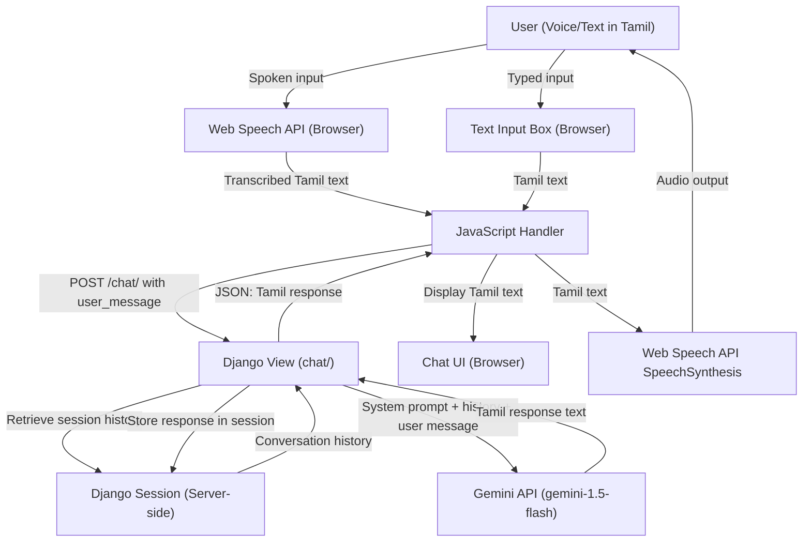

# Hackathon Analysis

> **Document:** HackathonAnalysis.md  
> **Generated:** 2026-10-01  
> **Skill:** hackathon-analysis  
> **Status:** Complete — Ready for Development

---

## 1. Hackathon Overview

| Field | Value |
|---|---|
| **Hackathon Name** | PromptWars x HACKARENA — Build with AI |
| **Organizer** | Google for Developers with Dr. MGR University |
| **Theme** | The Invisible Woman |
| **Challenge Focus** | Digital accessibility and inclusion for first-time rural women users |
| **Programming Language** | Python |
| **Framework** | Django (with required supporting frameworks) |
| **Development Time** | 4 hours |
| **Team Size** | 1 developer |
| **Target Platform** | Non-educated Indian women (first-time users) |
| **SDG Alignment** | Goal 5 (Gender Equality), Goal 4 (Quality Education), Goal 10 (Reduced Inequalities) |
| **Judging Criteria** | Not provided |
| **Submission Requirements** | Not provided |

---

## 2. Problem Statement

### 2.1 Actual Problem Statement

> "Build an AI tool that helps a first-time woman user — with no English, no tech background, and no one to ask — independently access one essential government service, scheme, or skill resource through voice or` simple text in her own language. The tool must require zero prior digital knowledge to use."

---

### 2.2 Simple English Explanation

A woman in rural India has never used a phone or the internet before. She does not speak English. She does not know how to type or navigate apps. There is no family member or friend available to help her.

She needs to find out about a government scheme that could benefit her — for example, a cooking gas subsidy, a health insurance scheme, or a skill training programme.

The task is to build an AI-powered tool that she can talk to (in her own language) or type a simple message to, which will then guide her — step by step, in plain language she understands — to find and access that scheme on her own.

---

### 2.3 Core Problem

**First-time rural women users cannot independently access government services or schemes because the digital systems are designed for English-literate, tech-experienced users.**

---

### 2.4 Root Problem

The root problem is a structural design failure: government digital portals, apps, and information systems assume a minimum literacy level, English proficiency, and prior digital experience that the target demographic does not possess. The problem is not the user's capability — it is the inaccessibility of the system itself.

Supporting context provided by the challenge:
- 48% of girls in rural India have never used the internet.
- Among those who have used it, most were guided by a male family member.
- This dependency on male guidance further reduces autonomous access.

---

### 2.5 Symptoms

- Rural women are unaware of schemes they are legally entitled to.
- When they try to use digital tools, they fail due to language barriers, literacy barriers, and navigation complexity.
- Awareness is dependent on proximity to other people who know these schemes.
- Eligible women do not enroll in available programmes.
- Skill training and livelihood resources go unused.

---

### 2.6 Consequences

If the problem remains unsolved:
- Women remain excluded from the digital economy and government welfare systems.
- Eligible beneficiaries do not receive financial, health, or skill support they are entitled to.
- Dependency on male family members for digital access continues.
- Gender inequality in digital access widens as more services move online.
- Sustainable Development Goals 5, 4, and 10 are not met.

---

## 3. Problem Breakdown

```
Inaccessible Government Services for Rural Women
├── Language Barrier
│   ├── Digital systems default to English
│   └── Regional language support is absent or incomplete
├── Literacy Barrier
│   ├── Users cannot read complex text
│   └── Navigation menus require text comprehension
├── Technical Knowledge Barrier
│   ├── No prior device usage experience
│   └── No familiarity with apps, browsers, or interfaces
├── Awareness Barrier
│   ├── Women do not know which schemes exist
│   └── Women do not know how to check eligibility
├── Dependency Barrier
│   ├── Access currently requires guidance from a male family member
│   └── No trusted, always-available source of guidance
└── Navigation Complexity
    ├── Government portals are complex and multi-step
    └── Error recovery requires technical understanding
```

### Sub-Problem Details

| Sub-Problem | Cause | Impact | Possible Solution | Priority |
|---|---|---|---|---|
| Language Barrier | Systems built for English/Hindi speakers | Immediate exclusion at first interaction | Voice/text in regional language | Critical |
| Literacy Barrier | Complex UI, text-heavy design | Cannot read instructions or buttons | Voice-first interface; simple icons | Critical |
| Technical Knowledge Barrier | No prior device use | Cannot navigate apps or browsers | Zero-knowledge UI; guided step-by-step flow | Critical |
| Awareness Barrier | No information channel in native language | Doesn't know what schemes exist | AI that explains schemes in plain language | High |
| Dependency Barrier | Systems require external help | No autonomous access | Self-sufficient AI guide requiring no helper | High |
| Navigation Complexity | Government portals not designed for novices | Cannot complete multi-step processes | AI abstracts complexity; presents one question at a time | High |

---

## 4. Stakeholders

| Stakeholder | Problem | Need | Expected Benefit |
|---|---|---|---|
| **First-time rural woman user** | Cannot access schemes independently | Voice/text guidance in her language | Aware of and able to access one scheme she is entitled to |
| **Rural family unit** | Family member (often male) must act as digital proxy | Remove burden from male family members | Family member freed from this role |
| **Government scheme administrators** | Low enrollment from eligible beneficiaries | Better outreach and uptake | Higher scheme uptake, better policy effectiveness |
| **NGOs and self-help groups** | Manually guide women to schemes (resource-intensive) | Scalable alternative to human guidance | Reduced manual effort, wider reach |
| **Hackathon organizers** | Want AI solutions addressing real social problems | Working Gemini-powered demo | Validated proof of concept for the theme |
| **Developer (solo)** | Must deliver a working solution in 4 hours | Clear scope, manageable complexity | A demonstrable product within the time window |

---

## 5. Target Users

### 5.1 Primary Target Users — First-Time Rural Woman User

| Attribute | Description |
|---|---|
| **Age range** | 18–55 |
| **Language** | Regional Indian language (Tamil, Hindi, Telugu, Bengali, Kannada, etc.) |
| **English proficiency** | None |
| **Digital experience** | Zero |
| **Literacy** | May be partially literate or illiterate (spoken language competence assumed) |
| **Device access** | Basic Android smartphone (someone else's, or recently acquired) |
| **Internet connectivity** | Low bandwidth, intermittent |
| **Goals** | Find a scheme that benefits her; complete an action (check eligibility, get information) |
| **Expected interaction** | Speak or type in her language; receive a spoken or simple text response |
| **Technical capability** | None — must require zero prior knowledge |

### 5.2 Secondary Target Users — NGO Workers and Self-Help Group Leaders

| Attribute | Description |
|---|---|
| **Role** | Community facilitators who assist women in accessing schemes |
| **Goal** | Use the tool on behalf of multiple women or teach women to use it |
| **Expected interaction** | Use the interface on behalf of beneficiaries in field visits |

### 5.3 System Administrators

| Attribute | Description |
|---|---|
| **Role** | Developer maintaining the Django application |
| **Goal** | Monitor conversations, update scheme data, manage the system |
| **Expected interaction** | Django admin panel |

---

## 6. Objectives

### 6.1 Primary Objectives

*(Explicitly required by the challenge)*

1. Build an AI tool that a first-time woman user with no English and no tech background can use independently.
2. Enable access to one essential government service, scheme, or skill resource.
3. Interaction must be through voice or simple text.
4. The tool must support at least one regional Indian language.
5. The tool must require zero prior digital knowledge.
6. Use Gemini (explicitly mentioned in the 4-hour scope).
7. Deliver within 4 hours (solo developer).

### 6.2 Secondary Objectives

*(Support the primary goal; strongly implied by the context)*

1. Explain scheme eligibility in plain, simple language.
2. Provide step-by-step guidance to the next action the user needs to take.
3. Make the interface welcoming and non-intimidating for a first-time user.
4. Avoid requiring the user to read complex English instructions.

### 6.3 Optional Objectives

*(Possible improvements; not required for the MVP)*

1. Support multiple regional languages.
2. Support multiple government schemes.
3. Provide downloadable or printable scheme summaries.
4. Allow NGO workers to register and track assisted users.

---

## 7. Requirements

### 7.1 Functional Requirements

| ID | Name | Description | Priority | Source | Dependencies |
|---|---|---|---|---|---|
| FR-01 | Voice Input | Accept spoken input from the user in a regional language | Critical | Problem Statement | Browser Web Speech API or Google Cloud STT |
| FR-02 | Regional Language Text Input | Accept typed text in a regional language (e.g., Tamil script) | Critical | Problem Statement | — |
| FR-03 | Gemini AI Response | Send user input to Gemini API; receive intelligent guidance | Critical | Explicit Requirement | Gemini API key |
| FR-04 | Regional Language Response | Respond to the user in the same regional language | Critical | Problem Statement | Gemini language capability |
| FR-05 | Voice Output (TTS) | Read the response aloud to the user | Critical | Problem Statement (voice interaction) | Browser TTS or Google Cloud TTS |
| FR-06 | Scheme Information | Provide information about one specific government scheme | Critical | 4-Hour Scope | Scheme data in system prompt |
| FR-07 | Eligibility Guidance | Guide user through eligibility criteria step by step | High | Problem Statement | FR-03, FR-06 |
| FR-08 | Next Step Guidance | Tell user exactly what to do next (e.g., "Go to your nearest Ration Shop") | High | Problem Statement | FR-03, FR-06 |
| FR-09 | Simple UI | Minimal interface with one large button; no complex navigation | Critical | Zero-knowledge requirement | — |
| FR-10 | Conversation History | Maintain conversation context within a session | High | AI interaction quality | FR-03 |
| FR-11 | Session Management | Store conversation session in database | Medium | Django requirement | Django ORM |
| FR-12 | Error Handling — API Failure | Show a simple, friendly message if Gemini API fails | High | Reliability | FR-03 |
| FR-13 | Error Handling — Voice Failure | Fall back to text input if voice fails | Medium | Reliability | FR-01 |

### 7.2 Non-Functional Requirements

| Category | Requirement | Priority | Notes |
|---|---|---|---|
| **Usability** | Interface must be operable with zero prior knowledge | Critical | Explicit requirement |
| **Accessibility** | Voice-first; minimal reading required | Critical | Explicit requirement |
| **Language** | Must support at least one regional Indian language | Critical | Explicit requirement |
| **Performance** | Response must arrive within 5 seconds on low bandwidth | High | User expectation in rural context |
| **Reliability** | System must handle API failures gracefully | High | Demo reliability |
| **Security** | No sensitive personal data stored without consent | Medium | Privacy concern for vulnerable users |
| **Simplicity** | No registration, login, or account required | Critical | Zero-knowledge requirement |
| **Compatibility** | Must work on basic Android browser (Chrome Mobile) | High | Target device |
| **Deployability** | Must be deployable or runnable for demo within 4 hours | Critical | Time constraint |

---

## 8. Constraints

### 8.1 Time Constraints

- **Total development time:** 4 hours
- This is an extreme constraint. Every feature that is not directly needed for the MVP demo must be deferred.
- Integration and testing time must be explicitly allocated within the 4 hours.

### 8.2 Team Constraints

- **Team size:** 1 developer
- No parallel development possible.
- All decisions, coding, testing, and demo preparation fall on one person.
- Scope must be aggressively minimal.

### 8.3 Technical Constraints

| Constraint | Detail |
|---|---|
| **Language** | Python (required) |
| **Framework** | Django (required) |
| **AI** | Gemini API (explicitly mentioned in scope) |
| **Voice** | Browser Web Speech API (free, no backend needed) or Google Cloud STT/TTS |
| **Regional Language** | At least one — recommendation: Tamil (strong Google support, relevant to Dr. MGR University, Chennai context) |
| **No JavaScript by default** | Preferred stack uses server-rendered HTML or HTMX; however, voice input requires JavaScript (browser APIs) |

> **Information Gap**
>
> The preferred technology note says "without JavaScript by default" but voice interaction (Web Speech API) requires JavaScript in the browser. This constraint will need to be relaxed for voice input. JavaScript will be used minimally for voice only.

### 8.4 Submission Constraints

> **Information Gap**
>
> Submission requirements were not provided in the hackathon description. Confirm before the end of the hackathon whether a repository link, demo video, deployed URL, or presentation is required.

---

## 9. Assumptions

**A-01:**
The developer has a working Gemini API key available before development begins.
*Reason:* Gemini is an explicit requirement and cannot be mocked in a demo.
*Risk:* If the key is unavailable or quota is exhausted, the core AI feature cannot be demonstrated.

**A-02:**
Tamil is selected as the primary regional language for the MVP.
*Reason:* The hackathon is hosted at Dr. MGR University (Chennai, Tamil Nadu). Tamil has strong Google Translate and Gemini language support.
*Risk:* If the target audience or judges expect a different language, a quick change to the system prompt is sufficient.

**A-03:**
PM Ujjwala Yojana (free LPG connection scheme) is selected as the one government scheme.
*Reason:* It is highly relevant to rural women, well-known, has a simple eligibility check, and the call-to-action (visit nearest distributor) is actionable offline.
*Risk:* Low — the scheme is well-established and information is publicly available.

**A-04:**
The demo device has a microphone and Chrome browser for voice input.
*Reason:* Web Speech API requires Chrome. Most Android devices have a microphone.
*Risk:* If the demo device does not support Web Speech API, the text input fallback covers the demo.

**A-05:**
No user registration or authentication is required.
*Reason:* Zero-knowledge requirement makes login an immediate barrier.
*Risk:* No personalization; conversation context is session-only.

**A-06:**
The system will be run locally (localhost) for the demo unless a quick cloud deployment is feasible.
*Reason:* 4-hour constraint makes production deployment risky.
*Risk:* Judges may request a public URL; if so, a quick Railway or Render deployment should be prepared.

**A-07:**
Gemini can respond accurately in Tamil when instructed with a well-crafted system prompt.
*Reason:* Gemini 1.5 Flash has documented multilingual capability including Tamil.
*Risk:* Response quality in Tamil may vary; the system prompt must explicitly instruct Tamil-only responses.

---

## 10. Solution Analysis

### Approach 1 — Minimal Django + Gemini + Browser Voice (Recommended)

| Field | Detail |
|---|---|
| **Description** | A single Django view serves a minimal HTML page. JavaScript handles Web Speech API for voice input and TTS for voice output. The page sends user input to a Django API endpoint, which calls Gemini with a carefully crafted system prompt. Gemini responds in Tamil. Response is displayed and read aloud. |
| **Advantages** | Simple stack; one file per concern; no external voice API cost; fully functional in 4 hours |
| **Disadvantages** | Web Speech API requires Chrome; voice quality depends on browser TTS |
| **Complexity** | Low |
| **Hackathon Feasibility** | High |
| **Dependencies** | Gemini API key; Chrome browser |
| **Risks** | Browser TTS quality in Tamil may be limited; Gemini API latency on slow connection |

### Approach 2 — Django + Gemini + Google Cloud STT/TTS

| Field | Detail |
|---|---|
| **Description** | Use Google Cloud Speech-to-Text and Text-to-Speech APIs for higher quality voice handling. Django backend processes audio, calls Gemini, and returns synthesized audio. |
| **Advantages** | Higher voice quality; more reliable language support |
| **Disadvantages** | Requires additional API keys and billing setup; significantly more complex; risky in 4 hours |
| **Complexity** | High |
| **Hackathon Feasibility** | Low — setup alone takes 30–60 minutes |
| **Dependencies** | Gemini API key; Google Cloud project; STT/TTS API keys |
| **Risks** | Setup complexity; billing setup; audio file handling in Django |

### Approach 3 — Pure Static HTML + Gemini API (No Django)

| Field | Detail |
|---|---|
| **Description** | A static HTML file with JavaScript calling Gemini API directly from the browser. |
| **Advantages** | Extremely fast to build |
| **Disadvantages** | Violates the Django requirement; Gemini API key exposed in frontend |
| **Complexity** | Very Low |
| **Hackathon Feasibility** | High technically, but not acceptable given the Django requirement |
| **Dependencies** | Gemini API key |
| **Risks** | Security: API key is public; violates stated framework requirement |

**Decision:** Approach 1 is the only viable option within the constraints.

---

## 11. Proposed Solution

**"Sahayika" — A Gemini-Powered Voice and Text Guide for Rural Women**

*(Sahayika = "Female Helper" in Sanskrit/Tamil context)*

A Django web application with a single, clean page that:

1. Greets the user in Tamil with a welcoming voice message.
2. Presents one large button: **"பேசுங்கள்"** (Speak).
3. When the user speaks or types in Tamil, their input is sent to Gemini.
4. Gemini — instructed via system prompt — responds **only in Tamil**, using **simple, spoken-word Tamil** (not formal/bureaucratic language), explaining:
   - What PM Ujjwala Yojana is.
   - Whether the user might be eligible.
   - What they need to do next (go to the nearest Fair Price Shop / Distributor with Aadhaar and BPL card).
5. The response is both displayed (in Tamil text) and read aloud by the browser TTS.

**The user never needs to read, navigate menus, or speak English.**

---

## 12. MVP

### 12.1 Must Have

- Single Django page with minimal UI (large button, no navigation)
- Voice input via Web Speech API (Tamil)
- Text input fallback (Tamil keyboard)
- Gemini API integration (system prompt in Tamil for PM Ujjwala Yojana)
- Tamil text response displayed on screen
- Tamil voice response via Web Speech API TTS
- Conversation context maintained within the page session
- Graceful error message if API fails

### 12.2 Should Have

- A welcoming greeting message read aloud on page load (in Tamil)
- Simple eligibility question flow (guided by Gemini)
- Clear "Next Step" instruction at the end of the conversation

### 12.3 Could Have

- A scheme icon or simple illustration to make the page less intimidating
- Support for Hindi as a second language (easy system prompt change)
- "Start Over" button with voice confirmation

### 12.4 Won't Have (in MVP)

- User login or registration
- Multiple schemes
- Database persistence of conversations beyond the session
- Google Cloud STT/TTS (too complex for 4 hours)
- Multiple language selection by the user
- Backend speech processing
- Admin dashboard
- Offline capability
- Push notifications

---

## 13. Feature Prioritization

| Feature | User Value | Technical Complexity | Priority | In MVP |
|---|---|---|---|---|
| Voice input (Tamil) | Very High | Low (Web Speech API) | Critical | Yes |
| Gemini Tamil response | Very High | Low (API call) | Critical | Yes |
| Voice output (Tamil TTS) | Very High | Low (Web Speech API) | Critical | Yes |
| Simple single-button UI | Very High | Very Low | Critical | Yes |
| Text input fallback | High | Very Low | High | Yes |
| Conversation context | High | Low (session variable) | High | Yes |
| Welcoming greeting on load | High | Very Low | High | Yes |
| Eligibility guidance flow | High | Low (system prompt) | High | Yes |
| Error handling | High | Low | High | Yes |
| Multiple languages | Medium | Medium | Medium | No |
| Multiple schemes | Medium | Low (prompt change) | Medium | No |
| User registration | Low | Medium | Low | No |
| Admin dashboard | Low | Medium | Low | No |
| Conversation persistence (DB) | Low | Low | Low | No |

---

## 14. User Flow

```
User arrives at the page
        ↓
Page loads — welcoming voice greeting in Tamil plays automatically
"நமஸ்காரம்! நான் உங்களுக்கு உதவ இங்கே இருக்கிறேன்."
        ↓
User sees one large button: "பேசுங்கள்" (Speak)
        ↓
User taps the button
        ↓
Browser microphone activates — listens for Tamil speech
        ↓
[Alternative] User types in Tamil in the text box
        ↓
Input is sent to Django backend
        ↓
Django sends input + conversation history to Gemini API
        ↓
Gemini responds in Tamil (simple, spoken-word language)
        ↓
Response is displayed on screen in Tamil text
        ↓
Browser reads the response aloud in Tamil
        ↓
User responds (speak or type)
        ↓
[Continue until] Gemini provides clear next action guidance
        ↓
"உங்கள் அருகில் உள்ள Fair Price Shop-க்கு Aadhaar கார்டுடன் செல்லுங்கள்."
        ↓
Session ends / User taps "மீண்டும் தொடங்கு" (Start Over)
```

### Error States

- **Microphone not available:** Show text input only; no error message that confuses the user.
- **API failure:** Display and speak "இப்போது ஒரு சிறிய தொந்தரவு. சற்று நேரம் பழிக்கவும்."
- **No speech detected:** Prompt the user to try again or type instead.

---

## 15. System Flow

```
Browser (Chrome Mobile)
        ↓
Web Speech API — captures spoken Tamil
        ↓
JavaScript sends text to Django view (POST /chat/)
        ↓
Django view — validates input, retrieves session history
        ↓
Gemini API call (google-generativeai Python SDK)
    → System prompt: Tamil-only, Ujjwala Yojana context
    → Conversation history appended
    → User message appended
        ↓
Gemini returns Tamil response text
        ↓
Django stores response in session; returns JSON response
        ↓
JavaScript receives response
        ↓
JavaScript updates chat display (Tamil text)
        ↓
Web Speech API SpeechSynthesis — reads Tamil text aloud
        ↓
User hears and sees the response
```

---

## 16. Data Flow



---

## 17. Architecture

```
+--------------------------------------------------+
|           Browser (Chrome Mobile)                |
|  +------------------------------------------+   |
|  |        Single Page (index.html)          |   |
|  |  - Large "Speak" button                  |   |
|  |  - Text input fallback                   |   |
|  |  - Chat display (Tamil text)             |   |
|  |  - Web Speech API (STT + TTS)            |   |
|  |  - Minimal JavaScript (voice only)       |   |
|  +-------------------+----------------------+   |
+---------------------|----------------------------+
                       | POST /chat/ (fetch API)
                       v
+--------------------------------------------------+
|           Django Application                     |
|  +--------------+   +------------------------+  |
|  | URL Router   +-->|  Chat View             |  |
|  +--------------+   |  - Session management  |  |
|                      |  - Input validation    |  |
|  +--------------+   |  - Gemini API call     |  |
|  | Django       |<--|  - Response handler    |  |
|  | Session      |   +------------------------+  |
|  | (Server)     |                               |
|  +--------------+                               |
+---------------------------+----------------------+
                            | google-generativeai SDK
                            v
+--------------------------------------------------+
|           Gemini API                             |
|  Model: gemini-1.5-flash                        |
|  System Prompt: Tamil-only, Ujjwala Yojana      |
|  Context: Conversation history                  |
+--------------------------------------------------+
```

**No database required for MVP.** Django session storage (file-based or cookie-based) is sufficient.

---

## 18. Technology Analysis

### Python

| Field | Detail |
|---|---|
| **Purpose** | Primary programming language |
| **Why It Fits** | Required by hackathon; Django is Python-native; Gemini SDK is Python-first |
| **Advantages** | Fast development; excellent AI library support |
| **Limitations** | None relevant to this scope |
| **Alternative** | None (required) |
| **Decision** | Use Python 3.11+ |

### Django

| Field | Detail |
|---|---|
| **Purpose** | Web framework |
| **Why It Fits** | Required by hackathon; provides routing, sessions, and template rendering with minimal boilerplate |
| **Advantages** | Built-in session management; admin panel; ORM if needed |
| **Limitations** | Slightly heavier than Flask for a single-page app |
| **Alternative** | Flask (lighter, but not specified) |
| **Decision** | Use Django 4.x or 5.x |

### Gemini API (gemini-1.5-flash)

| Field | Detail |
|---|---|
| **Purpose** | AI language model for understanding and responding in Tamil |
| **Why It Fits** | Explicitly required; multilingual; fast; free tier available |
| **Advantages** | Excellent multilingual support; understands spoken-style input; instructable via system prompt |
| **Limitations** | API key required; dependent on internet; latency on slow networks |
| **Alternative** | GPT-4o (not preferred given Gemini requirement) |
| **Decision** | Use gemini-1.5-flash (faster and cheaper than Pro) |

### Web Speech API (Browser)

| Field | Detail |
|---|---|
| **Purpose** | Voice input (STT) and voice output (TTS) |
| **Why It Fits** | Free; no backend needed; no additional API keys; works in Chrome |
| **Advantages** | Zero cost; zero setup; Tamil recognition supported in Chrome |
| **Limitations** | Chrome only; TTS quality varies by device; requires microphone permission |
| **Alternative** | Google Cloud STT/TTS (better quality but too complex for 4 hours) |
| **Decision** | Use Web Speech API for MVP |

### Django Sessions

| Field | Detail |
|---|---|
| **Purpose** | Conversation context storage within a session |
| **Why It Fits** | Django sessions work out of the box |
| **Advantages** | Zero configuration; no external database |
| **Limitations** | Not persistent across server restarts; no multi-device support |
| **Alternative** | PostgreSQL (overkill for MVP) |
| **Decision** | Use Django file-based sessions or cookie sessions |

---

## 19. Technology Recommendation

**Final Stack:**

| Layer | Technology | Justification |
|---|---|---|
| Language | Python 3.11+ | Required |
| Web Framework | Django 5.x | Required |
| AI Model | Gemini 1.5 Flash | Explicitly required; fastest and cheapest |
| Voice I/O | Browser Web Speech API | Zero cost; zero setup; sufficient for demo |
| Session Storage | Django sessions (file-based) | Zero configuration needed |
| Database | None (MVP) | Sessions are sufficient |
| Frontend | Django Templates + Minimal CSS + Minimal JS | Simplest approach; no build tools |
| Deployment | Localhost (demo) / Railway or Render (if public URL needed) | Fastest path |
| SDK | google-generativeai Python package | Official Gemini SDK |

---

## 20. Database Design

**For the MVP, no database is required.** Conversation context is stored in Django sessions.

If persistence is needed (post-hackathon), the following entities are relevant:

```
ConversationSession
├── id (UUID, PK)
├── session_key (string)
├── language (string, default "ta" for Tamil)
├── scheme (string, default "ujjwala")
├── created_at (datetime)
└── messages → [ConversationMessage]

ConversationMessage
├── id (UUID, PK)
├── session_id (FK → ConversationSession)
├── role (enum: "user" | "model")
├── content (text)
└── created_at (datetime)
```

**For the MVP:** Use Django session to store a list of `{"role": "user"|"model", "parts": ["..."]}` dicts.

---

## 21. API Design

### Internal Django Endpoints

| Method | Endpoint | Purpose | Auth | Request | Response |
|---|---|---|---|---|---|
| `GET` | `/` | Serve the main single-page interface | None | — | HTML page |
| `POST` | `/chat/` | Accept user message; return Gemini response | None (session-based) | `{"message": "Tamil text"}` | `{"response": "Tamil text"}` |
| `POST` | `/reset/` | Clear session conversation history | None | — | `{"status": "ok"}` |

### External API — Gemini System Prompt Pattern

```python
SYSTEM_PROMPT = """
நீங்கள் ஒரு அன்பான, எளிமையான தமிழ் உதவியாளர்.
நீங்கள் கிராமப்புற பெண்களுக்கு PM Ujjwala Yojana திட்டம் பற்றி 
எளிமையான தமிழில் விளக்குகிறீர்கள்.
எப்போதும் தமிழில் மட்டுமே பதிலளிக்கவும்.
எளிய, பேச்சு வழக்கு தமிழ் பயன்படுத்தவும்.
அரசு அலுவல் மொழி தவிர்க்கவும்.
ஒரு நேரத்தில் ஒரே ஒரு கேள்வி மட்டும் கேட்கவும்.
"""
```

---

## 22. Security Analysis

| Area | Risk | Mitigation |
|---|---|---|
| **Gemini API Key** | Key exposed if placed in frontend JS | Store in Django settings/environment variable; call Gemini from backend only |
| **Input Validation** | Malicious input to Gemini | Django view validates input length; Gemini handles prompt injection via system prompt |
| **CSRF** | POST requests require CSRF protection | Django CSRF middleware active by default; use csrf_token in form |
| **Session Fixation** | Session hijacking | Use Django's default session security; HTTPS in production |
| **Data Privacy** | Conversation data stored in session | No PII stored; session cleared on reset; no persistent storage in MVP |
| **XSS** | Displaying Tamil text from Gemini | Django templates auto-escape; use json_script for JS injection |
| **Rate Limiting** | Abuse of /chat/ endpoint | Not required for hackathon; document as post-MVP improvement |

**Note:** This application is designed for vulnerable users. No personal data should be stored without explicit consent. The MVP stores no personal data.

---

## 23. Privacy Analysis

| Category | Detail |
|---|---|
| **Personal data collected** | None (no login, no name, no phone number) |
| **Sensitive data** | Conversation content (may reveal poverty status, household situation) |
| **Data storage** | Django session only (server-side, cleared on session end) |
| **Data retention** | Session duration only; no database persistence in MVP |
| **Data sharing** | Conversation text is sent to Gemini API (Google); no other sharing |
| **User consent** | Not formally collected in MVP; should be added post-hackathon |
| **Data deletion** | Session cleared on "Start Over" or session expiry |

> **Information Gap**
>
> Google's Gemini API data usage policies (especially for training data) should be reviewed before production deployment involving vulnerable user conversations.

---

## 24. Performance Analysis

| Bottleneck | Cause | Priority | Mitigation |
|---|---|---|---|
| Gemini API Latency | Network round-trip to Google servers | High | Use gemini-1.5-flash (faster); show loading spinner with spoken feedback |
| Low Bandwidth | Rural connectivity | High | Responses are text-only (small payload); no images or audio files transmitted |
| Web Speech API | Browser processing | Low | Browser-native; no network call needed for STT |
| TTS Quality | Browser TTS engine | Medium | Acceptable for demo; Google Cloud TTS is post-MVP improvement |
| Django Response Time | Server processing | Very Low | No database queries; session read/write is fast |

**Optimization Priority:** Keep Gemini responses short (instructed via system prompt). A shorter response reads faster, uses less bandwidth, and is easier to understand.

---

## 25. Testing Strategy

### Unit Testing (Time budget: 15 minutes)

- Test Django chat view: valid input → expected Gemini call → response returned.
- Test session storage: messages appended correctly.
- Test reset view: session cleared.

### Integration Testing (Time budget: 15 minutes)

- Full flow: POST to `/chat/` with a Tamil message → Gemini responds in Tamil → response returned to browser.
- Verify CSRF token is handled correctly.

### End-to-End Testing (Time budget: 20 minutes — manual)

- Open page in Chrome mobile or Chrome desktop.
- Tap "Speak" button → speak a Tamil question → verify transcription.
- Verify Tamil text response appears.
- Verify TTS reads the response.
- Tap "Start Over" → verify session clears.
- Test text input fallback.

### Error Testing (Time budget: 10 minutes)

- Disable internet → verify graceful error message (in Tamil) appears.
- Enter empty input → verify no crash.

---

## 26. Risk Analysis

| Risk | Probability | Impact | Mitigation |
|---|---|---|---|
| Gemini API key not available | Low | Critical | Prepare key before hackathon starts |
| Gemini API quota exceeded | Low | High | Use gemini-1.5-flash (generous free tier) |
| Web Speech API Tamil recognition poor | Medium | High | Text input fallback always available |
| TTS Tamil voice quality poor | Medium | Medium | Still readable on screen; acceptable for demo |
| 4-hour time runs out | High | High | MVP-first; defer all non-critical features |
| Browser CSRF error | Low | High | Test CSRF handling early |
| Django session not persisting | Low | Medium | Test session storage early in development |
| Demo internet connectivity failure | Medium | High | Prepare a pre-recorded video demo as backup |
| Gemini responds in English despite Tamil prompt | Low | High | Test system prompt thoroughly early |
| Web Speech API not available on demo device | Medium | Medium | Use Chrome; text input as fallback |

---

## 27. Dependencies

| Dependency | Required? | Alternative | Failure Impact | Local Fallback |
|---|---|---|---|---|
| Gemini API | Yes — critical | OpenAI GPT-4o (not ideal) | Core feature fails | No (internet required) |
| google-generativeai Python SDK | Yes | Direct HTTP requests to Gemini REST API | Code complexity increases | Use requests library |
| Django | Yes — required | None | Core framework fails | None |
| Python 3.11+ | Yes | Python 3.9+ acceptable | Minor compatibility issues | Python 3.9 acceptable |
| Chrome Browser | Yes — for voice | Text input works in any browser | Voice feature unavailable | Text input fallback |
| Internet connection | Yes | None | Gemini calls fail | Graceful error message |
| Web Speech API | No (voice only) | Google Cloud STT | Voice input unavailable | Text input fallback |

---

## 28. Development Plan

```
Phase 1 — Project Setup             (0:00 – 0:20)
  - django-admin startproject sahayika
  - Create app: core
  - Install: google-generativeai
  - Configure settings: session, templates, static
  - Create .env file with GEMINI_API_KEY

Phase 2 — Core Django Backend       (0:20 – 1:00)
  - Create URL patterns (/, /chat/, /reset/)
  - Implement chat view (session + Gemini call)
  - Write system prompt (Tamil + Ujjwala Yojana)
  - Test /chat/ endpoint with curl or Postman

Phase 3 — Frontend — HTML/CSS       (1:00 – 1:45)
  - Create base.html with Tamil font (Noto Sans Tamil)
  - Design single-page layout: greeting, speak button, chat display, text input
  - Apply minimal CSS: large button, readable Tamil font, clean background

Phase 4 — Voice Integration         (1:45 – 2:30)
  - Add JavaScript for Web Speech API (STT)
  - Add JavaScript for SpeechSynthesis (TTS)
  - Connect voice input → POST /chat/ → TTS output
  - Test full voice loop

Phase 5 — Integration and Polish    (2:30 – 3:00)
  - Greeting TTS on page load
  - Error handling (API failure → Tamil error message → TTS)
  - Reset button functionality
  - CSRF handling verification
  - Loading indicator during Gemini call

Phase 6 — Testing                   (3:00 – 3:30)
  - Full end-to-end test
  - Tamil input/output test
  - Error scenario test
  - Mobile browser test

Phase 7 — Demo Preparation          (3:30 – 4:00)
  - Prepare demo script
  - Record backup demo video (in case of connectivity failure)
  - Optional: deploy to Railway/Render if public URL requested
  - Final review
```

---

## 29. Time Allocation

**Total: 4 hours (240 minutes)**

| Phase | Activity | Duration |
|---|---|---|
| Phase 1 | Project Setup | 20 min |
| Phase 2 | Django Backend + Gemini | 40 min |
| Phase 3 | Frontend HTML/CSS | 45 min |
| Phase 4 | Voice Integration (JS) | 45 min |
| Phase 5 | Integration and Polish | 30 min |
| Phase 6 | Testing | 30 min |
| Phase 7 | Demo Preparation | 30 min |
| **Total** | | **240 min** |

> **Critical Rule:** If Phase 2 is not complete and tested by the 1-hour mark, skip Phase 3 styling polish and prioritize functional completion. A working but plain interface is better than a beautiful but broken one.

---

## 30. Team Responsibilities

**Solo Developer — All responsibilities:**

| Responsibility | Time Period |
|---|---|
| Architecture decisions | Phase 1 |
| Backend development | Phase 2 |
| Frontend development | Phase 3 |
| Voice integration | Phase 4 |
| Integration testing | Phase 5–6 |
| Demo preparation | Phase 7 |

**Priority order if time runs short:**
1. Working `/chat/` endpoint with Gemini (non-negotiable)
2. Text input working in browser (non-negotiable)
3. Tamil TTS response (high priority)
4. Voice input (STT) (medium priority — text fallback covers it)
5. Polished UI (lowest priority)

---

## 31. Demo Strategy

**Demo Flow:**

```
Problem Statement (30 seconds)
  "48% of rural women in India have never used the internet.
   Government schemes exist — but they can't access them."
        ↓
Show the interface (15 seconds)
  "This is Sahayika — a Gemini-powered assistant.
   One page. One button. No English. No tech knowledge needed."
        ↓
Live Demo (60 seconds)
  1. Open page → greeting plays in Tamil automatically
  2. Tap "பேசுங்கள்" → speak in Tamil: "Ujjwala yojana enna?"
  3. Gemini responds in Tamil → TTS reads it aloud
  4. Ask follow-up: eligibility question
  5. Gemini gives clear next-step guidance in Tamil
        ↓
Impact Statement (30 seconds)
  "A first-time user. No English. No help.
   She just independently accessed a government scheme."
        ↓
Future Vision (30 seconds)
  "10 regional languages. 50+ schemes.
   AI access to government services for every woman in India."
```

**Backup Plan:** If internet is unavailable during demo, play a pre-recorded video of the working application.

---

## 32. Presentation Structure

*(Recommended structure — not based on official judging criteria)*

1. **Problem** — The digital exclusion of rural women
2. **Existing Situation** — 48% never online; dependency on male family members
3. **The Design Failure** — Systems are inaccessible by design, not user incapability
4. **Proposed Solution** — Sahayika: Gemini-powered Tamil voice guide
5. **Target Users** — First-time woman user; zero English; zero tech background
6. **Key Features** — Voice input; Tamil response; TTS output; one scheme; zero navigation
7. **User Flow** — Walk through the complete user journey
8. **Architecture** — Simple diagram (Django + Gemini + Browser Voice API)
9. **Technology** — Python, Django, Gemini 1.5 Flash, Web Speech API
10. **Live Demo** — Full voice interaction in Tamil
11. **Expected Impact** — SDG 5, 4, 10 alignment; first step to autonomous digital access
12. **Future Improvements** — Multiple languages, multiple schemes, offline capability

---

## 33. Evaluation Criteria Analysis

> **Information Gap**
>
> Official judging criteria were not provided in the hackathon description. The following are **potential evaluation areas** based on common hackathon evaluation frameworks and the challenge context. These are **not confirmed official criteria**.

| Potential Area | Relevance to This Solution | How to Demonstrate |
|---|---|---|
| **Problem Relevance** | High — directly addresses the stated challenge | Opening 60 seconds of presentation |
| **Functionality** | High — working voice/text → Gemini → Tamil response | Live demo |
| **Technical Implementation** | Medium — clean Python/Django/Gemini stack | Code walkthrough if asked |
| **Usability** | Very High — zero-knowledge interface is a key differentiator | Show the interface; emphasize simplicity |
| **Innovation** | Medium-High — voice + regional language + AI for this demographic | Innovation section in presentation |
| **Impact** | Very High — SDG alignment is explicit in the challenge | Impact slide with SDG references |
| **Presentation** | Medium — clarity of problem + demo + vision | Tight 3-minute demo flow |

---

## 34. Existing Solution Analysis

| Existing Solution | What It Does | Strengths | Limitations | Gap | Our Differentiation |
|---|---|---|---|---|---|
| **MyGov App** | Government information portal | Official; comprehensive | English-first; complex navigation; requires digital literacy | Not usable by target user | Voice-first; zero navigation; Tamil-only |
| **UMANG App** | Unified government services app | Multi-scheme access | English/Hindi; requires login; multi-step navigation | Too complex for first-time user | Single scheme; no login; one button |
| **Jan Samarth Portal** | Scheme eligibility checker | Comprehensive eligibility | English; form-based; requires reading | Cannot be used by target user | Conversational; voice-driven; Tamil |
| **Google Assistant** | General voice assistant | Multilingual; widely deployed | Generic; not scheme-specific; assumes tech familiarity | Not purpose-built for rural women | Purpose-built; guided flow; specific scheme |
| **Jugalbandi (MS)** | Voice AI for government schemes | Similar concept; validated approach | Separate project; not available in this hackathon | Validates the approach | Hackathon-buildable; Django-based |

> **Note:** Jugalbandi (Microsoft Research India) is a closely related project. Its existence validates the problem space and the technical approach. It should not be presented as a competitor but as evidence that this problem is real and the approach is proven.

---

## 35. Innovation Analysis

The solution is differentiated in the following ways:

1. **Zero-knowledge interface design** — The entire interface is designed for someone who has never touched a smartphone. This is not just multilingual support; it is a fundamental redesign of the interaction model.

2. **Purpose-built conversation flow** — Unlike general-purpose assistants, the system prompt is engineered specifically for one scheme, one language, and one user type. This produces a higher-quality, more reliable experience for the target user.

3. **Voice-first, text-fallback** — Voice is the primary modality (literacy barrier bypassed). Text is a fallback (not the default). This is the opposite of most digital services.

4. **No navigation** — The user never navigates menus, pages, or options. The AI handles all complexity internally. The user only speaks or types.

5. **Spoken-word language** — Gemini is instructed to use colloquial, spoken-style Tamil, not formal bureaucratic Tamil. This makes responses genuinely understandable by the target user.

---

## 36. Failure Scenarios

| Scenario | Detection | Response | Fallback | User Message (Tamil) | Recovery |
|---|---|---|---|---|---|
| **Gemini API failure** | HTTP error from SDK | Catch exception in view | Show/speak error message | "இப்போது ஒரு சிறிய தொந்தரவு. சற்று நேரம் பழிக்கவும்." | User can retry |
| **Microphone permission denied** | Web Speech API error event | Hide voice button; show text only | Text input | Show Tamil text: "தயவுசெய்து இங்கே தட்டச்சு செய்யுங்கள்." | Text input available |
| **No speech detected** | Web Speech API nomatch/end event | Re-prompt user | Show text input | "மீண்டும் பேசுங்கள் அல்லது இங்கே தட்டச்சு செய்யுங்கள்." | Retry |
| **Empty input** | Django view validation | Return error JSON | Frontend shows message | "கொஞ்சம் பேசுங்கள் அல்லது தட்டச்சு செய்யுங்கள்." | User retries |
| **Gemini responds in English** | System prompt issue | Test system prompt before demo | Pre-test thoroughly | N/A | Refine system prompt |
| **Session loss** | Django session expiry | Start new session transparently | New session | "புதிதாக ஆரம்பிக்கலாம். என்ன தெரிந்துகொள்ள விரும்புகிறீர்கள்?" | New conversation |
| **Internet failure during demo** | Gemini API timeout | Show graceful error | Play pre-recorded backup video | Tamil error message displayed | Use backup video |

---

## 37. Future Scope

### MVP (Hackathon Scope)
- One language: Tamil
- One scheme: PM Ujjwala Yojana
- Voice + text input
- Gemini response
- TTS output
- Session-based context

### Post-Hackathon Improvements

| Feature | Effort | Impact |
|---|---|---|
| Support 10 Indian regional languages | Medium | Very High |
| Support 10+ government schemes | Low (prompt engineering) | Very High |
| Google Cloud TTS for higher-quality Tamil voice | Medium | High |
| Offline capability (cached responses for common questions) | High | High |
| NGO worker dashboard | Medium | Medium |
| Scheme eligibility structured assessment | Medium | High |
| Integration with official government APIs | Very High | Very High |
| Progressive Web App (installable without app store) | Medium | High |
| Low-literacy image-based UI option | Medium | High |
| Automated scheme enrollment assistance | Very High | Very High |

---

## 38. Feasibility Analysis

| Dimension | Rating | Reason |
|---|---|---|
| **Development Complexity** | Low | Single Django view + Gemini API call + minimal JS |
| **Integration Complexity** | Low | One external API; browser-native voice APIs |
| **Deployment Complexity** | Low | Localhost for demo; one-command Railway deploy if needed |
| **Time Pressure** | Very High | 4 hours is extremely tight for a solo developer |
| **Technical Risk** | Low | All technologies are well-documented and proven |
| **Scope Risk** | Medium | Temptation to add features will be the main risk |
| **Overall Scope** | Small | Deliberately minimal — one page, one API, one scheme |

**Overall Verdict:** Technically feasible within 4 hours if scope is strictly controlled. The primary risk is scope creep.

---

## 39. Final Recommendations

1. **Select Tamil and PM Ujjwala Yojana immediately.** Do not spend hackathon time on this decision.

2. **Write and test the system prompt first.** Before building the UI, verify that Gemini responds correctly in Tamil about Ujjwala Yojana. The system prompt is the heart of the application.

3. **Build the backend `/chat/` endpoint before the frontend.** Test it with curl or a browser form first. Once it works, build the voice UI on top of it.

4. **Use Web Speech API — do not attempt Google Cloud STT/TTS.** The setup time is too high for the 4-hour window.

5. **No database needed.** Django sessions are sufficient. Do not waste time setting up PostgreSQL.

6. **Keep the UI radically simple.** One button. One text area. Large Tamil font. No navigation. No menus.

7. **Prepare a backup video.** Record a working demo video before the presentation in case of internet failure.

8. **Name the application.** "Sahayika" communicates warmth and purpose during the presentation.

9. **Cite the 48% statistic in the presentation.** It is provided by the challenge itself and powerfully anchors the problem.

10. **Align explicitly with SDG 5, 4, and 10 in the presentation.** The challenge provides this alignment — use it.

---

## 40. Final Checklist

- [x] Hackathon information extracted
- [x] Problem statement understood
- [x] Problem decomposed
- [x] Target users identified
- [x] Objectives identified
- [x] Functional requirements identified (FR-01 – FR-13)
- [x] Non-functional requirements identified
- [x] Constraints identified
- [x] Assumptions documented (A-01 – A-07)
- [x] MVP defined
- [x] Features prioritized
- [x] User flow defined
- [x] System flow defined
- [x] Data flow defined (Mermaid diagram)
- [x] Architecture analyzed
- [x] Technology options analyzed
- [x] Technology recommendation justified
- [x] Database requirements analyzed (none needed for MVP)
- [x] API requirements analyzed (3 internal endpoints + Gemini)
- [x] Security analyzed
- [x] Privacy analyzed
- [x] Performance analyzed
- [x] Testing strategy defined
- [x] Risks identified
- [x] Dependencies identified
- [x] Development plan created (7 phases)
- [x] Time allocation created (4-hour window, 240 minutes)
- [x] Team responsibilities defined (solo developer)
- [x] Demo strategy created
- [x] Presentation structure created (12 slides)
- [x] Judging criteria: not provided — potential areas documented
- [x] Existing solutions analyzed (MyGov, UMANG, Jan Samarth, Jugalbandi)
- [x] Innovation opportunities identified
- [x] Failure scenarios analyzed
- [x] Future scope separated from MVP
- [x] Feasibility analyzed
- [x] Information gaps clearly marked
- [x] No unsupported requirements invented

---

*Analysis complete. Development can begin using this document as the primary planning reference.*
